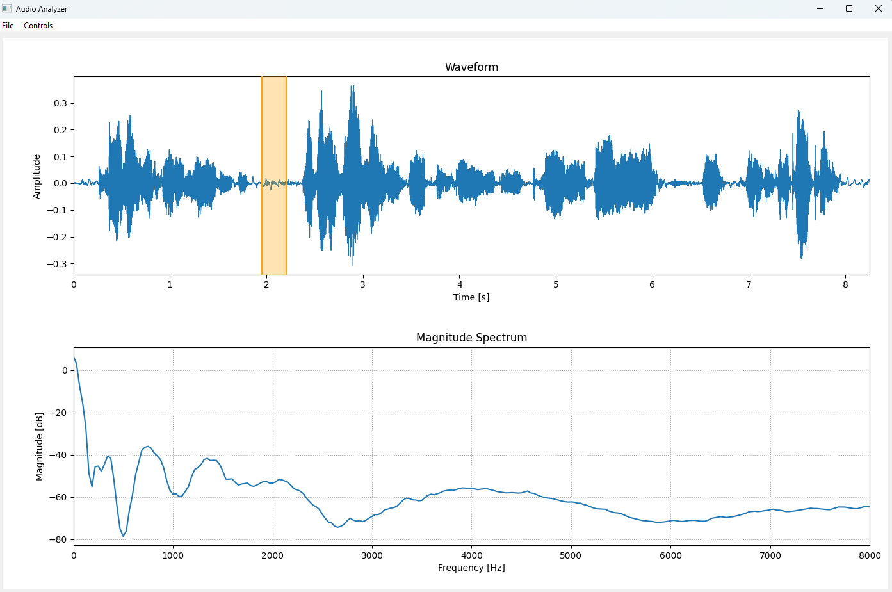

# WAV Audio Analyzer

A Python-based GUI application to visualize WAV audio files, view waveforms, analyze magnitude spectra, and adjust controls such as FFT size, octave smoothing, and frequency scale. The application allows interactive time selection and zooming for detailed analysis.

## Features

- Load and visualize WAV audio files.
- Display waveform and magnitude spectrum.
- Select a time range interactively using the mouse.
- Zoom in/out on waveform via menu options.
- Control options via menus:
  - **FFT Size:** 256, 512, 1024, 2048, 4096, 8192, 16384 (default: 512)
  - **Octave Smoothing:** Off, 1/2, 1/3, 1/4, 1/6 (default: Off)
  - **Frequency Scale:** Linear, Logarithmic (default: Linear)
- Reset view to full waveform.
- Single selection per control option (mutually exclusive).

## Installation

1. Clone the repository:

```bash
git clone https://github.com/rameshtsnuv/Audio-Analyzer.git
cd Audio-Analyzer
```

2. Install dependencies:

```bash
pip install -r requirements.txt
```

Dependencies include:

- PyQt5
- numpy
- soundfile
- matplotlib
- scipy

## Usage

Run the application with:

```bash
python audioanalyzer.py
```

- Open a WAV file using `File -> Open WAV`.
- Select time segments directly on the waveform.
- Adjust FFT size, octave smoothing, and frequency scale from the `Controls` menu.
- Zoom in/out using the `Zoom` submenu with `+` and `-` buttons.
- Reset the waveform view using `Controls -> Reset View`.

## Project Structure

```
wav-audio-analyzer/
├── audio_analyzer.py          # Main Python script
├── README.md                  # This README file
├── requirements.txt           # Dependency list
├── screenshot.png             # GUI screenshot placeholder

```

## Screenshot


## Notes

- The application ensures that only one option is checked at a time in each control section.
- Default values are set when the UI loads for FFT size, smoothing, and frequency scale.
- Zoom functionality is integrated as a submenu with `+` (zoom in) and `-` (zoom out) buttons.

## License

MIT License

